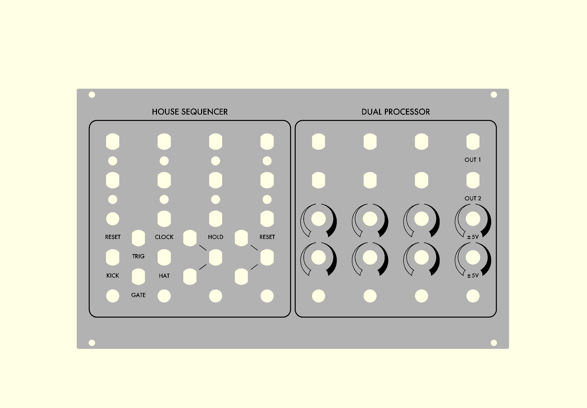

# 3U-Serge



File [plan.scad](plan.scad) contains the code which can be reused to draw similar 3U panels or any other sizes. Can be opened with [OpenSCAD](https://openscad.org).     

Implemented useful eurorack related functions:
```scad
module M3() { circle(d = m3); }
module MiniJack() { circle(d = 6.0 + tolerance); }
module Toggle() { circle(d = 6.35 + tolerance); }
module Button() { circle(d = 6.35 + tolerance); }
module Pot() { circle(d = 7.0 + tolerance); }
module LED3() { circle(d = 4.34 + tolerance); }
module LED5() { circle(d = 6.35 + tolerance); }

module Banana() {
	intersection() { 
		circle(d = 8.0 + tolerance);
		square(
			size = [6.35 + tolerance, 8.0 + tolerance], 
			center = true
		);
	}
}

// Switchcraft N112BPCX
module Jack() {
	intersection() {
		circle(d = 9.525 + tolerance);
		square(
			size = [8.382 + tolerance, 9.525 + tolerance], 
			center = true
		);
	}
}

module XLR() {
	d = 24.0;
	id = 23.6;
	hd = 19.0;
	
	circle(d = id);
	translate([-hd / 2, d / 2]) M3();
	translate([hd / 2, -d / 2]) M3();
}
```
### Finished product:


